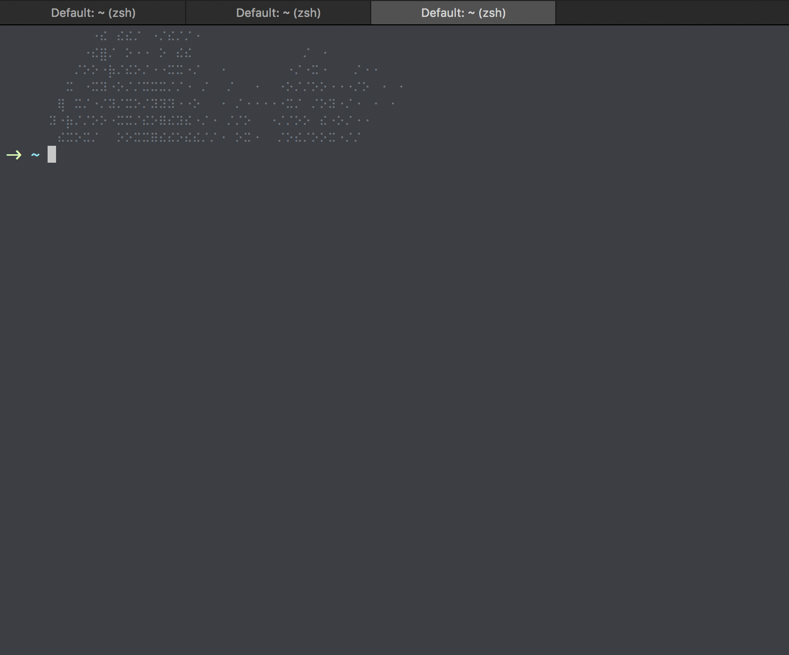

# Generate a starfield
`starfield` will generate a hash visualization based on string input.

## Usecase

validate some data:

```sh
echo "~/*path*/*to*/starfield $(executable)" >> ~/.bashrc;
```
where `~/*path*/*to*` is the directory you've placed starfield in
and `$(executable)` is any script you'd like validated



starfield will produce a hash visual via the [drunken-bishop hash visualization algorithm](https://pthree.org/2013/05/30/openssh-keys-and-the-drunken-bishop/)

---
### Notes
the algorithm is based on the columns available in your terminal window, if this number is inconsistent, the hash visualization will also be inconsistent. In my usecase, terminal always opens at 90 columns wide, I recommend you do the same (or similar) but modifications could be made if needed.
